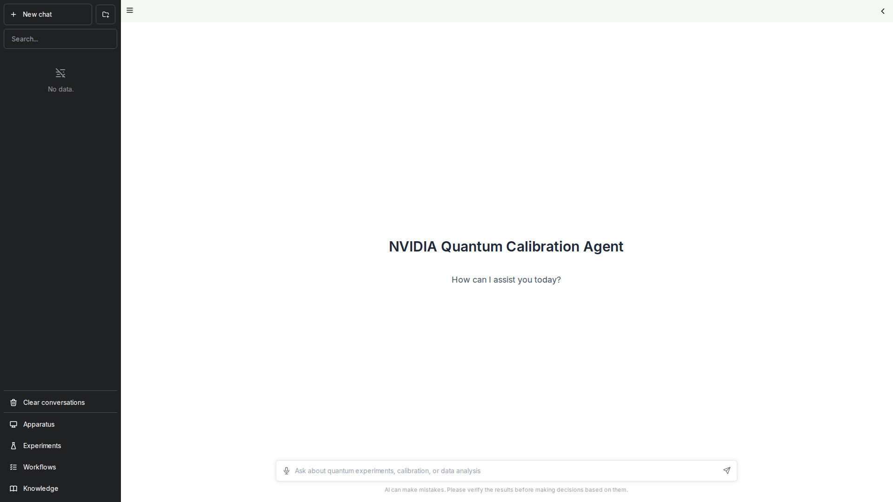
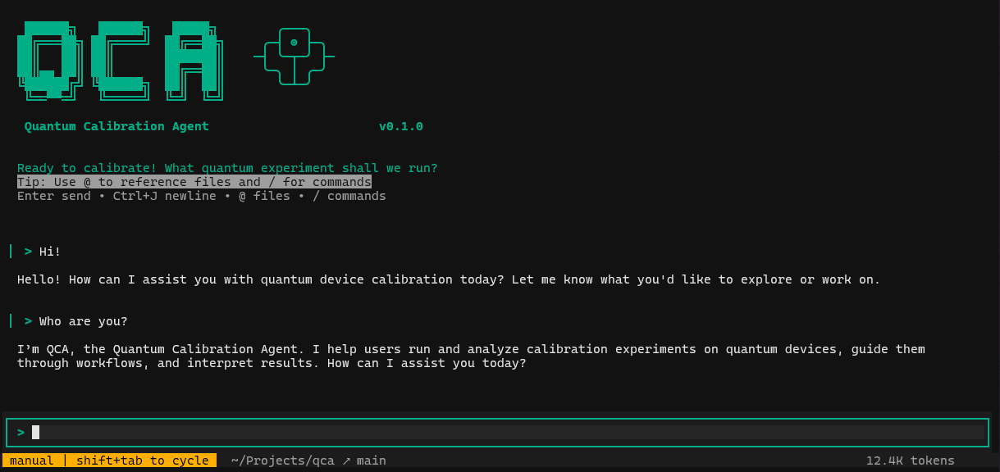

# NVIDIA Ising Calibration

## Cookbook and Quantum Calibration Agent Blueprint


AI-powered quantum device calibration using the DeepAgents framework. QCA provides an intelligent agent interface for discovering, executing, and analyzing quantum calibration experiments with support for automated workflows and vision-based analysis.


*The Web UI provides a chat interface for natural language interaction with the calibration agent.*


*The CLI provides a terminal-based interface for quantum calibration experiments.*

## What is QCA?

QCA (Quantum Calibration Agent) is an AI-powered framework that combines:

- **Intelligent Experiment Discovery**: Automatically find and understand available quantum calibration experiments
- **AI-Driven Execution**: Run experiments through natural language commands or structured workflows
- **Visual Analysis**: Inspect plots and data using vision language models (VLMs)
- **Workflow Automation**: Execute complex multi-step calibration sequences with built-in validation
- **Smart Data Management**: Store and retrieve experiment results with HDF5 and SQLite

The agent supports multiple LLM providers including NVIDIA, Anthropic, and OpenAI.

## Repository Structure

```
ising-calibration/
├── cli.py              # Main CLI entry point
├── server.py           # FastAPI backend server
├── prompt.py           # Agent system prompt loader
├── config.yaml         # DeepAgents configuration
├── core/               # Core library (storage, discovery, runner)
├── tools/              # DeepAgents tools (lab, workflow, VLM)
├── scripts/            # Quantum experiment implementations
├── tests/              # Unit and integration tests
├── ui/                 # Web UI (Next.js)
└── cookbook/           # Documentation and runtime data
    ├── data/           # Runtime data (experiments, workflows, knowledge base)
    └── ...             # Guides, tutorials, user stories
```

## Quick Start

### Prerequisites

- Python 3.11+
- Node.js 18+ and npm 9+ (for Web UI)
- API key from one of the supported providers:
  - [NVIDIA API Catalog](https://build.nvidia.com/) (default)
  - [Anthropic](https://console.anthropic.com/)
  - [OpenAI](https://platform.openai.com/)

### Installation

```bash
# Clone repository
git clone https://github.com/NVIDIA/ising-calibration.git
cd ising-calibration

# Set up Python environment
python -m venv .venv
source .venv/bin/activate  # Windows: .venv\Scripts\activate
pip install -e .

# Install UI dependencies
cd ui && npm install && cd ..

# Configure environment
cp .env.example .env
# Edit .env and add your API key (choose one):
# NVIDIA_API_KEY=nvapi-your-key-here
# ANTHROPIC_API_KEY=sk-ant-your-key-here
# OPENAI_API_KEY=sk-your-key-here
```

### Running QCA

**Option 1: Full System (Backend + Web UI)**

```bash
# Terminal 1 - Start Backend
qca serve

# Terminal 2 - Start Web UI
cd ui && npm run dev
```

Open http://localhost:3000 in your browser.

**Option 2: CLI Only**

```bash
qca
```

**Option 3: Non-Interactive Commands**

```bash
qca experiments list
qca experiments run t1_measurement
qca workflow list
```

## Key Features

- **Interactive TUI**: Rich terminal interface for conversational experiment management
- **Web UI**: Browser-based chat interface with experiment visualization
- **CLI Commands**: Direct command-line access to all functionality
- **Experiment Scripts**: Write Python experiments with automatic parameter discovery
- **Workflow Engine**: JSON-based workflow definitions with state tracking
- **VLM Integration**: Analyze plots and experimental data visually
- **History Tracking**: Complete experiment history with SQLite indexing

## CLI Commands

### Main Commands

| Command | Description |
|---------|-------------|
| `qca` | Launch interactive TUI (default) |
| `qca serve` | Start the backend server |
| `qca -n "prompt"` | Run single prompt non-interactively |
| `qca -r <thread_id>` | Resume previous conversation |

### Experiment Management

| Command | Description |
|---------|-------------|
| `qca experiments list` | List all available experiments |
| `qca experiments schema <name>` | Show experiment parameter schema |
| `qca experiments run <name>` | Execute an experiment |

### Workflow Management

| Command | Description |
|---------|-------------|
| `qca workflow list` | List all workflows |
| `qca workflow show <id>` | Display workflow definition |
| `qca workflow status <id>` | Check runtime progress |

### History and Data

| Command | Description |
|---------|-------------|
| `qca history list` | List past experiment executions |
| `qca history show <id>` | Show detailed experiment results |
| `qca data arrays <id>` | List arrays stored in experiment |

## Documentation

Full documentation and tutorials are available in the [`cookbook/`](cookbook/) directory:

```bash
pip install -e ".[docs]"
cd cookbook && make html
# Open cookbook/_build/html/index.html
```

## Development

```bash
# Install with test dependencies
pip install -e ".[test]"

# Run tests
pytest

# Run with coverage
pytest --cov=core --cov=tools
```

## Contributing

See [Contributing.md](Contributing.md) for guidelines on submitting pull requests, coding standards, and the development workflow.

## License

[Apache License 2.0](LICENSE) - Copyright 2025 NVIDIA Corporation
