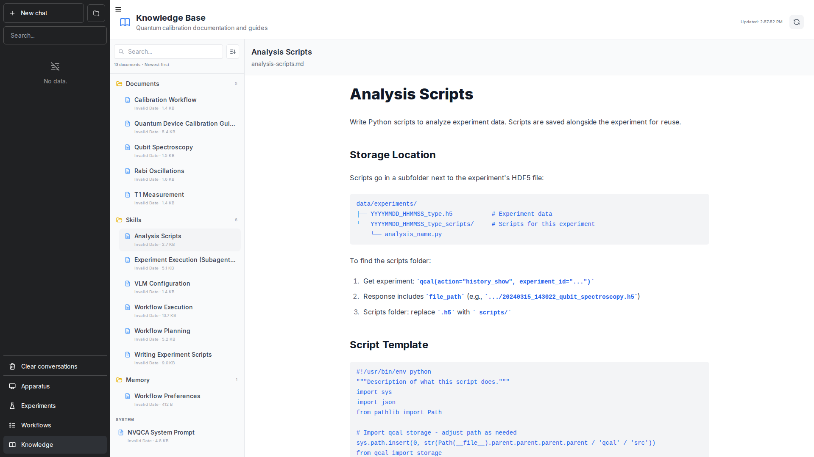

The Knowledge Base stores reusable documents, notes, and scripts that the AI agent can reference during calibration sessions. This provides persistent context across conversations.

<Frame caption="The Knowledge Base panel showing analysis scripts and documentation.">
  
</Frame>

## Overview

The Knowledge Base contains:

- **Documents** - Calibration notes, device specifications, and reference materials
- **Skills** - Reusable analysis scripts and utility functions
- **Workflow Preferences** - Guidelines for how the agent should approach calibration tasks

## Using the Knowledge Base

### Via Web UI

1. Click the **Knowledge** button in the sidebar
2. Browse categories in the left panel
3. Click any document to view its contents
4. The agent automatically references relevant documents during conversations

### Via CLI

List knowledge base contents:
```bash
qca knowledge list
```

View a specific document:
```bash
qca knowledge show <document-name>
```

## Document Categories

### Documents

Reference materials and calibration notes:
- Device specifications
- Calibration procedures
- Troubleshooting guides

### Skills

Reusable analysis scripts:
- **Analysis Scripts** - Python scripts for analyzing experiment data
- **Writing Experiment Scripts** - Templates for creating new experiments

### Preferences

Agent behavior configuration:
- **Workflow Preferences** - Guidelines for calibration approaches

## Adding Custom Documents

Place markdown files in the `data/knowledge/` directory:

```
data/knowledge/
├── memory/
│   └── workflow-preferences.md
└── skills/
    ├── analysis-scripts.md
    └── writing-experiment-scripts.md
```

The agent will automatically discover and reference these documents.

## Next Steps

- [CLI Overview](/user-guide/cli-overview) - Command-line reference
- [Workflows](/user-guide/workflows) - Multi-step calibration workflows
