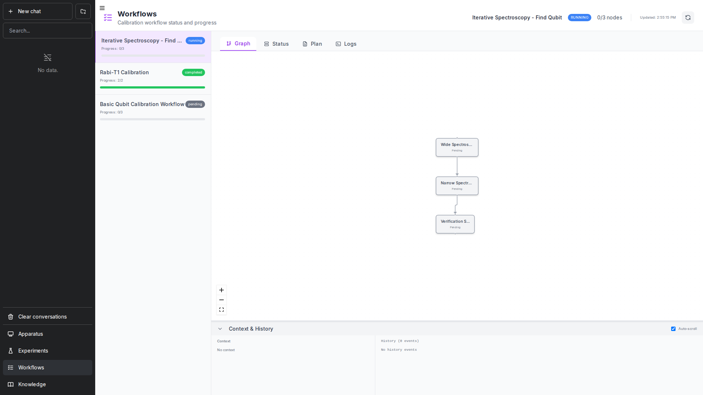

The workflow system in QCA enables you to orchestrate complex multi-step experiment sequences as directed acyclic graphs (DAGs). Each workflow consists of nodes (experiment steps) with explicit dependencies, allowing for automated execution with retry logic, failure handling, and progress tracking.

<Frame caption="The Workflows panel showing workflow list and DAG visualization.">
  
</Frame>

## What is the Workflow System?

A workflow is a collection of experiment nodes that execute in a defined order based on their dependencies. Each node represents a discrete experiment step with:

- Unique identifier and name
- List of dependencies (must complete before this node runs)
- State tracking (pending, running, success, failed, skipped)
- Extracted results that feed into downstream nodes
- Run count for retry tracking

Workflows are stored in `data/workflows/{workflow_id}/` with:
- `workflow.json` - Current workflow state
- `plan.md` - Planning document (optional but recommended)
- `history.jsonl` - Append-only event log

## Workflow Lifecycle

Workflows progress through distinct states:

```
created → running → paused/completed/failed
```

- **created**: Initial state after workflow creation
- **running**: Actively executing nodes
- **paused**: Execution stopped, awaiting human decision
- **completed**: All nodes successfully completed
- **failed**: Workflow cannot proceed due to unrecoverable failures

## Node States

Individual nodes transition through states during execution:

```
pending → running → success/failed/skipped
```

- **pending**: Node waiting to execute (dependencies not met or not started)
- **running**: Node currently executing
- **success**: Node completed successfully with extracted results
- **failed**: Node failed after retries
- **skipped**: Node intentionally skipped (optional step or blocked path)

## When to Use Workflows

Workflows are ideal for:

- **Multi-step calibration sequences**: Resonator spectroscopy → qubit spectroscopy → Rabi → T1/T2
- **Experiments with dependencies**: Where later steps need results from earlier steps
- **Long-running processes**: Track progress across interruptions
- **Automated retry logic**: Handle transient failures without manual intervention
- **Complex decision trees**: Conditional execution based on results

Use workflows when you need:
- Dependency management between experiments
- Automatic state persistence
- Failure recovery and retry logic
- Progress monitoring for long sequences
- Context sharing between experiment steps

For simple, single-step experiments, use the CLI directly (`qca experiments run`) or the lab tool.

## Key Concepts

### DAG Structure

Workflows are directed acyclic graphs:
- **Directed**: Edges (dependencies) have direction (A depends on B)
- **Acyclic**: No circular dependencies allowed
- Nodes can have multiple dependencies
- Nodes can be depended on by multiple downstream nodes
- Multiple root nodes enable parallel execution

### Context Sharing

Results from completed nodes are extracted and stored in the workflow context:

```json
{
  "context": {
    "resonator_frequency": 5.823,
    "qubit_frequency": 4.52
  }
}
```

Later nodes reference context values in their parameters.

### Subagent Execution

Each node executes via a subagent that:
- Reads experiment execution instructions
- Runs the experiment with specified parameters
- Analyzes results against success criteria
- Retries with parameter adjustments if needed
- Returns extracted values or failure observations

This architecture allows the workflow executor to focus on orchestration while subagents handle experiment-specific logic.
